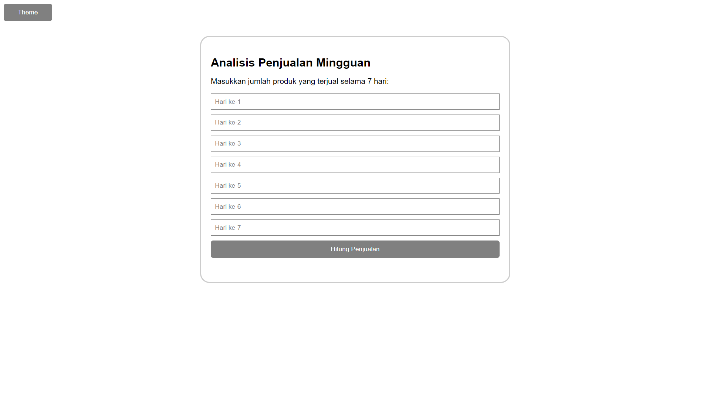
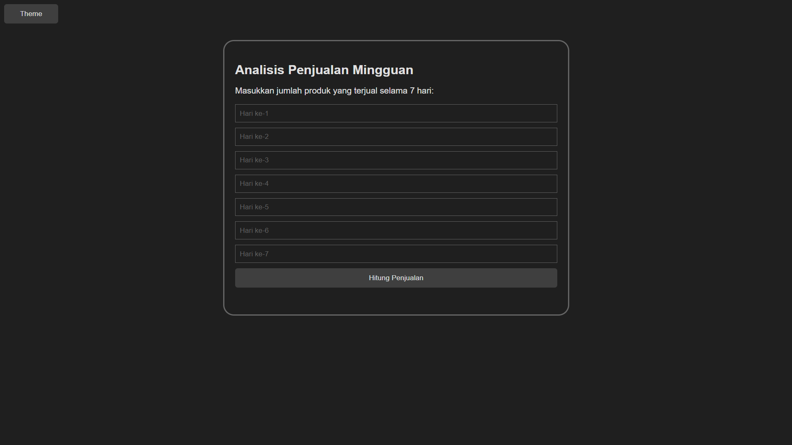
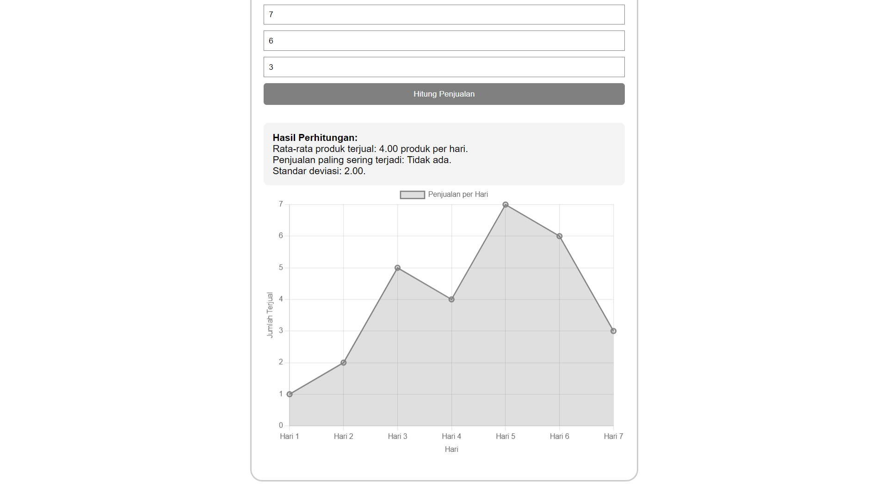
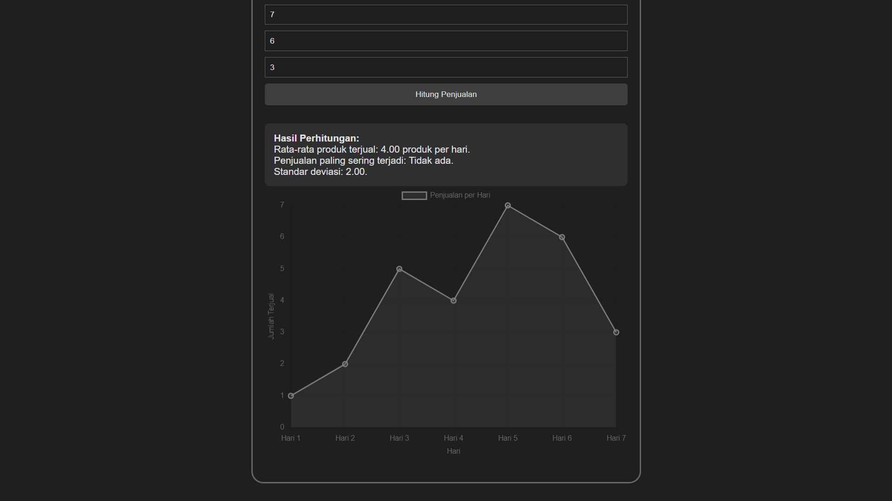

# Analisis Penjualan Mingguan

## Tentang Aplikasi
Analisis Penjualan Mingguan adalah aplikasi berbasis web yang menghitung analisis dari penjualan produk selama 7 hari. Dibuat hanya menggunakan HTML, CSS, dan JavaScript. Aplikasi ini dibuat untuk memenuhi tugas Probabilitas dan Statistika

## Fitur Aplikasi
1. Menghitung rata rata jumlah produk terjual
2. Menghitung jumlah penjualan paling sering
3. Menghitung standar deviasi dari penjualan
4. Menampilkan grafik dari perhitungan selama 7 hari
5. Mengubah theme tampilan aplikasi

## Link Aplikasi
https://bilxdi.github.io/probstat-analisispenjualan/

## Dokumentasi

  <table>
    <tr>
      <td align="center">
         
        <b>Form Light</b>
      </td>
      <td align="center">
         
        <b>Form Dark</b>
      </td>
    </tr>
    <tr">
      <td align="center">
         
        <b>Hasil Light</b>
      </td>
      <td align="center">
         
        <b>Hasil Dark</b>
      </td>
    </tr>
  </table>

